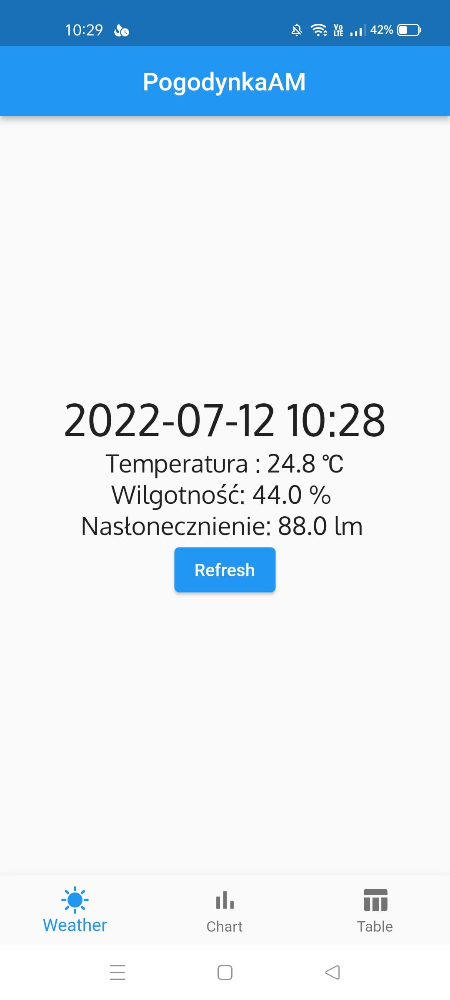
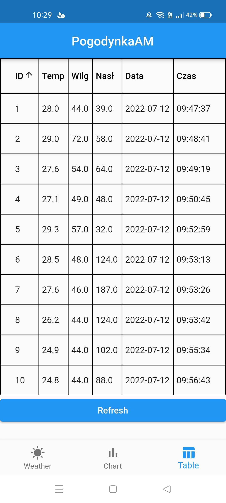

# Weather station
Port app for mobile to show measurements from IOT controller and sensors. You can put anywhere small device and check some value like temperature, insolation and 
humidity. Apps allow to check last measurement, which is refresh after 1 minute. Data from sensor can be shown with line chart and user can touch point and hint bar show
hours of measurement and value. Furthermore, last but not least is datatable where are shown all measurment in well-visually way.

## Technologies
Project is created with:
* Flutter
* Mysql
* package mysql1
* package intl
* package syncfusion_flutter_charts

## Screen
* Home view with last measurement

* Chart view with all measurements

* Chart View with touch measurement and show hint

* Datatabale view to better visualization 

